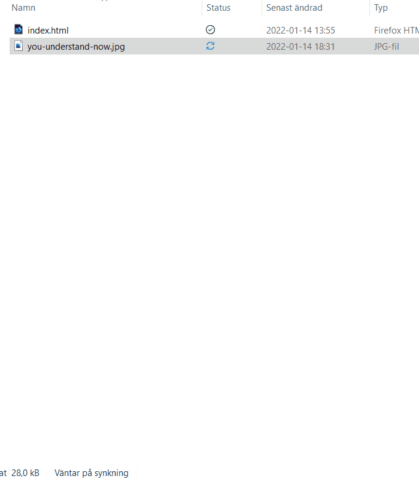

För att länka in en bild till en hemsida behöver du använda taggen `` och attributet `src`.

<Notice half="true">

Till skillnad från många andra taggar behöver img-taggen inte stängas.

</Notice>

# Hur man lägger in en bild

Skriv in img-taggen med src-attributet länkat till bilden du vill använda. Så här;

```html


```

# Var är filen?

Attributet `src` bestämmer vilken bild som ska visas, och fungerar på liknande sätt som attributet `href` gör i en a-tagg (länk).

Om sidan ligger på en server någonstans behöver
# Hur stor är filen?

Utan några andra attribut utöver `src` kommer bilden bli lika stor som dess upplösning i pixlar.



För att styra bildens storlek, använd attributen `width` och/eller `height` för att styra bredden, respektive höjden.

# Alt för tillgänglighet

Enligt specifikationen för HTML ska img-taggar alltid innehålla ett `alt` vars värde beskriver vad som finns på bilden.

Detta är för att göra bildens innehåll tillgängligt för alla, då detta visas istället för bilden om bilden inte laddas, och beskrivningen kan användas av användare som har nedsatt syn och använder ett tillgänglighetsverktyg som läser upp beskrivningen.

Alt-attributet behöver inte innehålla "bild av" eller liknande, detta brukar läggas till automatiskt.

Däremot bör du ge en så bra beskrivning som möjligt. Har du till exempel en bild på en hund bör du beskriva vad hunden gör (tex "*en svart hund springer*") om det är applicerbart.
