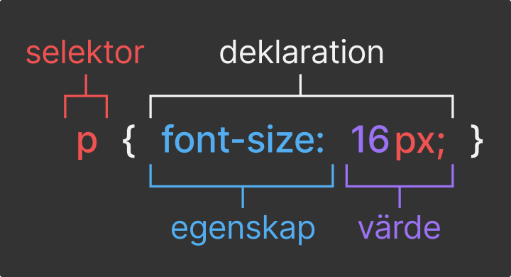

CSS står för *Cascading Style Sheet* och är ett sätt för oss att ändra utseendet på vår HTML.

HTML bestämmer hur innehållet ska struktureras och hur de olika delarna av innehållet ska presenteras. CSS däremot bestämmer hur sidan ska se ut.

# Selektorer och deklarationer bildar regler

CSS bygger på att vi skapar regler som styr utseendet på HTML-elementen vi skapat på sidan.

En CSS-regel består av två saker; en eller flera **Selektorer** och en eller flera **Deklarationer**.



# Selektorer

*Selektorer* bestämmer (väljer) **vilka** element vars utseende ska ändras.

Vi kan till exempel bestämma att alla paragraf-element ska ha grön text, eller att en specifik rubrik ska ha ett annat typsnitt än andra.

```css
p {
  color: green;
}

h2 {
  font-family: Verdana;
}
```


Man kan tänka det lite som att en selektor söker efter HTML-element som matchar deras beskrivning, och bestämmer över alla som matchar den beskrivningen.

## Flera selektorer

En CSS-regel kan ha flera selektorer, och betyder att regeln gäller för alla element som matchar någon av selektorerna. Man separerar selektorerna med ett kommatecken.

```css
/* Får alla p, h2, och li-element att ha textfärgen röd */
p, h2, li {
  color: red;
}
```


# Deklarationer

En *deklaration* bestämmer **vad** i utseendet som ska ändras och **hur** det ska ändras.

Deklarationer är i sin tur uppdelad i två delar; *Egenskap* och *Värde*.

**Egenskapen** är **vad**, och är till exempel textfärgen (*color*) och textstorleken (*font-size*), eller marginalen (utrymmet) från andra element.

**Värdet** är vad egenskapen ska sättas till. Vad detta är, är baserat på egenskapen - för textfärgen kan vi till exempel använda en av 140 fördefinerade webbfärgerna eller ett hexvärde som bestämmer färgen, men för textstorleken och marginalen använder vi ett mått i en bestämd enhet, till exempel pixlar (px), procent (%), eller *em* (ett typografiskt mått som är relativ till typsnittets storlek - i webben är 1em=16px).

# Exempel

## HTML

```html
<body>
  <h3>Lorem Ipsum</h3>
  <p>Lorem ipsum dolor sit amet.</p>
</body>
```

## CSS

```css
body {
  color: hsla(359, 85%, 50%, 1);
  font-size: 30px;
}
```

## Resultat

<div style="color: hsla(359, 85%, 50%, 1); font-size: 30px; text-transform: none; text-align:left;">
<h3 style="color: hsla(359, 85%, 50%, 1); font-size: 30px; text-transform: none; text-align:left;">Lorem Ipsum</h3>
<p>Lorem ipsum dolor sit amet.</p>
</div>

