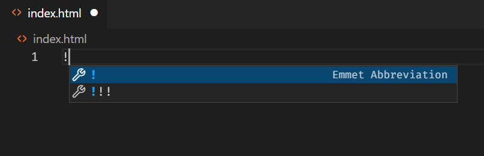
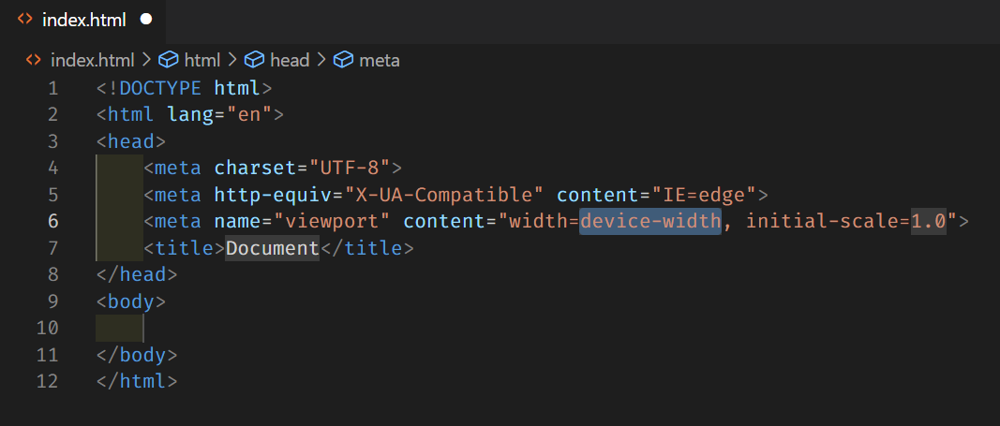

Hur skapar man ett nytt HTML-dokument och startar ett nytt webbprojekt?

# Den aktiva foldern

När du ska skapa ett nytt dokument, se först till att du är i rätt folder.

Gå till File och välj Open Folder. Därifrån går du till (eller skapar) den foldern där du ska arbeta.

<Notice>

För Webbutveckling brukar man skapa en folder för varje nytt projekt så man håller projekten isär från varandra.

</Notice>

När du är i rätt folder, använd funktionen **New File** (*Ctrl+N*)

# Namnge filen

När du namnger filen, tänk på att inte använda mellanslag. Om du .

Avsluta filens namn med filändelsen för filen du ska skapa - för ett HTML-dokument är filändelsen **.html** som sätter filens typ. Du kan se att du gjort rätt när en ikon syns till vänster om filens namn, där VSCode visar att den känner igen filtypen.

# Börja koda

Ett bra sätt att börja koda är genom att använda kommandot **!**.

I filen, skriv *!* och tryck på Enter-knappen. Detta bör skapa html-taggarna html, head, och body, och låter dig börja skriva en hemsida.

Du är nu redo att börja koda i ditt nya HTML-dokument.