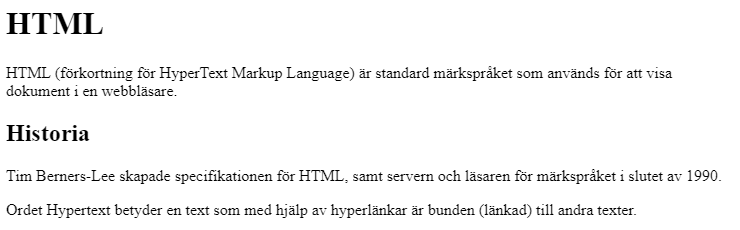

Dessa övningar har som syfte att öva dig på att använda HTML-taggar.

När du är klar, ladda upp HTML-filerna till kursens portfolio på SchoolSoft.

# Förberedelser

Skapa ett HTML-dokument och namnge dokumentet (med hjälp av `title`-taggen). Dokumentets namn ska vara ditt namn.

# 1: Börja skriva HTML

I `<body>`-taggen, lägg till en huvudrubrik, en paragraf, en underrubrik, och under den, lägg till två paragrafer.

Använd taggarna h1, p, och h2 på de rätta platserna och fyll dem med någon valfri information, till exempel om HTML, ditt favoritspel, eller liknande.

När det är klart bör det se ut ungefär så här (förutom att texten kommer vara annorlunda):

# 2: Inkapsling

Använd taggarna `<em></em>` och `<strong></strong>` för att kapsla in delar av dina meningar där du ska lägga ytterligare vikt. Man brukar lägga extra vikt vid till exempel namn, förkortningar, och termer.

# 3: Länkar

1. Skapa ett nytt dokument i samma folder som ditt tidigare dokument, namnge det **andra.html**.
2. Lägg till några HTML-element (rubriker, paragrafer) och fyll dem med information om HTML som du hittat online. 
3. Använd `<a>`-taggen med `href`-attributet för att skapa länkar i dokumenten som länkar till varandra.

# Inlämning

När du är klar, ladda upp båda HTML-filerna till kursens portfolio på SchoolSoft.

# Vad kommer sen?

Under de kommande lektionerna kommer vi arbeta med **bilder**, introducera **CSS**, och arbeta med **layout** med hjälp av **Flexbox**.

Till nästa lektion, läsa på om hur bilder fungerar i HTML.