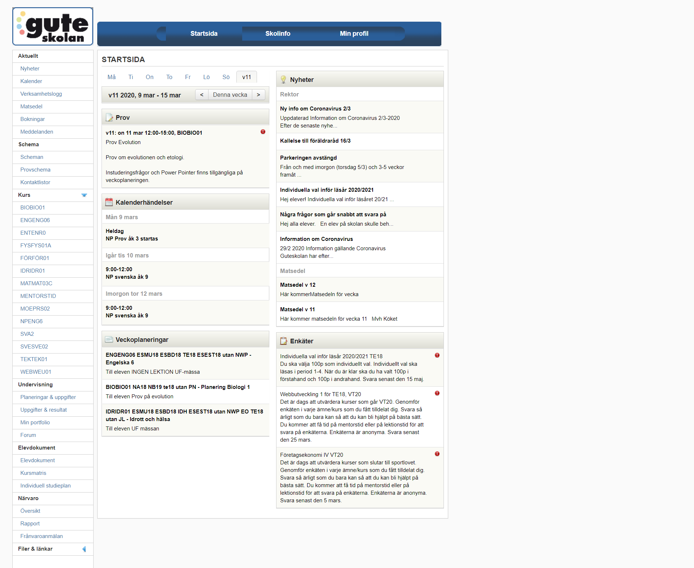

<!--

Really want a semi-small project where they create a mini-site and uses the following techniques:

- CSS custom variables
- BEM
- Color system

Project: Create sales cards
Have that as a mini-project?

Lesson 1: Intro to CSS custom variables + some laborations
Lesson 2: Laborations
Lesson 3: Intro to BEM + custom variables

-->

<!--
TODO: Dashboard
Inspiration
Utförande
SchoolSoft startsida
-->

I det här projektet ska ni skapa ett designsystem, och använder metodiken BEM för att skapa ett så kallat Dashboard.

Ett Dashboard är ett typ av grafiskt användargränssnitt som har som syfte att visa information "at a glance". Dashboards kan även kallas Översikt eller Rapport. Dashboard kommer från intrumentbrädan på bilar, där föraren behöver snabbt hämta in information om bilens olika instrument (så som hastighetsmätaren, klockan, varvmätaren, osv). [(Källa: Wikipedia)](https://en.wikipedia.org/wiki/Dashboard_(business))

Ett exempel på ett Dashboard är startsidan som ni kommer till när ni loggar in på SchoolSoft. **Och det är denna dashboard som ni ska designa om i det här projektet**.

Kolla in inspiration till [Dashboard på Dribbble](https://dribbble.com/tags/dashboard), och, om du vill, kolla in mer information om [Dashboards (svenska)](https://www.metamatrix.se/vad-ar-en-dashboard/).

# Vad ni ska göra
Ni ska använda er av Figma och HTML&CSS för att skapa en ny version av översiktsidan (dashboarden) ni ser när ni loggar in på SchoolSoft.

**I er utvecklingsprocess så ska ni göra följande:**

## 1. Researcha och hämta inspiration

1. Logga in på SchoolSoft och undersök översiktssidan
2. Identifiera dashboardens olika block och element, och om du kan hitta några modifiers.
3. Skriv ner vad för information som du får från dashboarden, och fundera kring vilken information du tycker är viktig och vilken information som bör presenteras. Saknas något? Är något överflödigt? Anteckna och skissa!
4. Gå in på [Dribbble](https://dribbble.com/tags/dashboard) och hämta inspiration till dashboards. Du kan söka efter andra källor också.

**OBS! Du behöver inte ha med menyn eller headern. Endast dashboarden är en del av projektet. Vill du lägga in det så får du, men är inget krav.**

## 2. Designa
Skapa en design för din dashboard i Figma. **Du bör använda components och styles**.

Tänk på hur du delar upp din information och den visuella hirarkin. Du ska dela in informationen i kort, där varje kort innehåller en gruppering av information och dess (om det finns några) actions.

Du väljer själv vilka färger du vill använda, men det är rekommenderat att du väljer en primär färg, en sekundär färg, och en grå färg, samt en vit och en svart färg.

> Du behöver inte vara begränsad av SchoolSofts storlek, eller den layout som de valt (men din dashboard ska lämna viss rum för en potentiell sidmeny på sidan). Igen, fundera kring vad som är mest relevant - se till att det syns tydligast.

## 3. Utföra (HTML&CSS)
När du känner dig hyfsat klar med din design så är det dags att ta in det i HTML och CSS.

I den här fasen ska du använda [CSS variabler](https://guteteknik.netlify.com/webb2/csskoncept) och [BEM](https://guteteknik.netlify.com/webb2/bem/).

Identifiera vad som är Block, Element, och om du har några varianter som ska läggas in som Modifiers.

I övrigt arbetar du som vanligt med din HTML och CSS.

## 4. Dokumentera och reflektera
Skriv en kort dokumentation om vad du gjort. Här kan du highlighta vad du identifierade som viktig information, vad du gillar och inte gillar med SchoolSofts nuvarande dashboard, och vad du tänkte på när du gjorde din omdesign.

Slutligen skriver du en kort reflektion om ditt arbete. Du ska minst svara på följande frågor, men det måste inte vara upplagt som "fråga -> svar":
- Vad gick bra?
- Vad gick mindre bra?
- Vad kan du göra bättre nästa gång?

Förslagsvis så skriver du din dokumentation i en egen sektion under din dashboard, eller på en egen hemsida.

## 5. Lämna in
Ni kommer få tillgång till webbhotellet så ni kan ladda upp er dashboard.

Jag går igenom hur ni gör på onsdagen, men det finns även en [guide på kurshemsidan för Webb1](https://guteteknik.netlify.com/webb1/slides/other/ftp).

Dashboarden och dokumentationen ska vara uppladdad i slutet av veckan, och skicka länken till hemsidan och din Figmafil (via Share-knappen i övre högra hörnet i Figma) till mig på kursportfolion.

## Moment i kursplanen som berörs:

- Utvecklingsprocessen för ett webbtekniskt projekt med målsättningar, planering, specifikation av struktur och design, kodning, optimering, testning, dokumentation och uppföljning.
- Fördjupning i märkspråk där det huvudsakliga innehållet är standarderna för HTML och CSS...
- Språk med stöd för variabler för att förenkla CSS-generering.
- Riktlinjer för god praxis inom webbutveckling.

## Bedömning:

- Eleven gör en enkel projektplan för en tänkt produkt. Utifrån projektplanen utvecklar eleven i samråd med handledare produkten där logiker som styr innehåll, design och beteende i begränsad utsträckning är åtskilda.
-  I arbetet utvecklar eleven kod som med tillfredsställande resultat följer standarder och som omfattar någon teknik för märkspråk och stilmallar där eleven i begränsad utsträckning använder tekniker för att generera stilmallskod.
-  I arbetet bearbetar eleven med tillfredsställande resultattext, bild och eventuell annan media så att de blir anpassade för att fungera i produkten.
- När arbetet är utfört gör eleven en enkel dokumentation av de moment som har utförts samt utvärderar med enkla omdömen sitt arbete och resultat.

# SchoolSoft dashboard:

